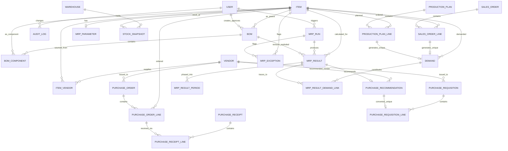

# Dopar MRP — Architecture & Database Schema

Status: **approved**, Phase 0 (project foundation) and Phase 1 (Zoho
Inventory integration foundation) implemented on top of it. This document is
the source of truth for the system design; implementation follows it exactly
unless a technical blocker forces a change, in which case the change is
called out explicitly (see "Implementation notes / deviations" near the
bottom).

Note on phase numbering: the phase list below is the one actually being
executed against (confirmed across the Phase 0/1/2 kickoff messages) and
supersedes any earlier draft numbering — in particular, Zoho OAuth
connection and entity synchronization were combined into a single Phase 1
("Zoho Inventory Integration Foundation") rather than split across two
phases.

## 1. Objective and business principle

Dopar MRP is a standalone web application (not a Zoho Creator app) that
answers: what to manufacture, when, what materials are required per the
approved BOM, what's actually in stock, what's already on order, the net
shortage, what/how much/when to purchase, which vendor, and which shortages
are critical.

**Zoho Inventory is the source of truth for transactional data**: items,
SKU, UOM, stock, warehouses, vendors, sales orders, purchase orders,
purchase receives. **Dopar MRP is the source of truth for planning data**:
BOMs and revisions, MRP parameters (lead time, MOQ, safety stock, scrap,
criticality, make/buy), MRP calculations and results, purchase
recommendations. Zoho-owned data is synced into a local cache for fast,
reliable MRP calculation and is never overwritten by planning workflows;
MRP-owned planning parameters are never overwritten by sync. This is a
**single-company system for Dopar Energy — no multi-tenancy.**

## 2. Development phases

| Phase | Scope                                                                                                                                                                                                                                  | Status      |
| ----- | -------------------------------------------------------------------------------------------------------------------------------------------------------------------------------------------------------------------------------------- | ----------- |
| 0     | Project foundation: Next.js, TypeScript, Postgres, Prisma, auth, RBAC, logging, error handling, testing, linting, folder structure, docs                                                                                               | **Done**    |
| 1     | Zoho Inventory integration foundation: OAuth2 flow, encrypted token storage, API client (retry/backoff/rate-limit/pagination), sync jobs for Item/Vendor/Warehouse/Purchase Order/Purchase Receipt/Sales Order/Stock, minimal admin UI | **Done**    |
| 2     | Master Data + BOM Management (Item/Vendor/Warehouse/MRP-parameter UI, full BOM lifecycle)                                                                                                                                              | Not started |
| 3     | Demand & production plan module                                                                                                                                                                                                        | Not started |
| 4     | MRP calculation engine (time-phased)                                                                                                                                                                                                   | Not started |
| 5     | Purchase recommendations & consolidation                                                                                                                                                                                               | Not started |
| 6     | Approval workflow                                                                                                                                                                                                                      | Not started |
| 7     | Push approved purchases to Zoho as POs                                                                                                                                                                                                 | Not started |
| 8     | Dashboards & exception reports                                                                                                                                                                                                         | Not started |

Phase 1 is built and fully tested against **mocked** Zoho responses — no
real Zoho API app is registered yet, so the actual OAuth round-trip with
Zoho is untested against the live API (see §9.7 "Connecting to a real
Zoho org"). No BOM explosion, no MRP engine, no fake/demo data exist in
this codebase.

## 3. System architecture

```
                    Zoho Inventory (source of truth for transactions)
                                  |  REST API, OAuth2 (Phase 1 — built, inert until
                                  |  real ZOHO_CLIENT_ID/SECRET are configured)
                                  v
                 lib/zoho/  — OAuth token mgmt, paginated resumable sync jobs,
                              idempotent upsert by zohoXxxId, errors -> SyncLog
                                  |
                                  v
                 PostgreSQL (Prisma) — Zoho cache tables + MRP planning tables
                                  |
                                  v
                 services/  — business logic (BOM, demand, MRP engine — future)
                                  |
                                  v
                 Next.js App Router — Route Handlers / Server Actions,
                 every mutation re-checks role server-side (lib/auth/rbac.ts)
                                  |
                                  v
                 React (Server Components) — Dashboard / Items / BOM / MRP /
                 Recommendations / Purchase Orders / Sync / Reports / Settings
```

### Technology stack

- **Framework:** Next.js 16 (App Router), React 19, TypeScript (strict mode
  plus `noUncheckedIndexedAccess`, `noImplicitOverride`,
  `forceConsistentCasingInFileNames`, `noFallthroughCasesInSwitch`)
- **Database:** PostgreSQL 16, accessed through Prisma's `@prisma/adapter-pg`
  driver adapter (Prisma 7 requires an explicit adapter — see "Phase 0
  deviations")
- **ORM:** Prisma 7 (pinned to the last stable `7.10.0`, not the `8.0.0-rc`
  currently tagged `latest` on npm)
- **Auth:** Auth.js v5 (`next-auth@beta`), Credentials provider, JWT
  sessions (no `Session`/`Account` tables — nothing to store since there's
  no OAuth provider or database session strategy)
- **Validation:** Zod
- **Logging:** Pino (structured JSON; pretty-printed in development), with
  password/token fields redacted
- **Testing:** Vitest (unit + integration against real Postgres), Playwright
  (E2E)
- **Lint/format:** ESLint (`eslint-config-next` + `typescript`), Prettier
- **Styling:** Tailwind CSS (scaffolded; no UI beyond the minimal
  login/landing page exists yet — dashboards are Phase 8)

### Folder structure

```
prisma/                  schema.prisma, migrations/, seed.ts
src/
  app/                   Next.js App Router pages, API routes
    zoho/                Zoho integration status page + Server Actions
    api/zoho/oauth/callback/   OAuth callback Route Handler (GET)
  components/{ui,tables,forms,layout}/   (empty until Phase 8 UI work)
  lib/
    auth/                password hashing (bcryptjs), server-side RBAC
    db/                   Prisma client singleton (driver-adapter wired)
    errors/               AppError hierarchy + toApiError()
    logging/               pino logger
    mrp/                   MRP engine — empty, Phase 4
    validation/            Zod schemas
    zoho/                  Zoho integration — built, Phase 1
      types.ts             shared types with zero server-only deps (Client-Component-safe)
      errors.ts             ZohoApiError hierarchy + app-facing ZohoNotConnectedError etc.
      redact.ts             secret redaction for logs/SyncLog.errorDetails
      auth/                 encryption.ts, oauth.ts, state.ts, connection.ts
      client/                zohoApiClient.ts (retry/backoff/rate-limit/timeout),
                              pagination.ts, connectedClient.ts (DB-backed wiring)
      mappers/               one file per entity: Zod schema + Zoho->Prisma mapping
      sync/                  engine.ts (generic) + one syncX.ts per entity + index.ts
  services/                zohoIntegrationService.ts (more to come per future phase)
  types/                   ambient type augmentations (next-auth module augmentation)
  auth.ts / auth.config.ts / proxy.ts   Auth.js config (split for Edge-runtime compatibility, see file comments)
tests/
  unit/zoho/  integration/zoho/  e2e/
docs/{architecture.md,decisions/}
```

### API architecture

Next.js Route Handlers under `/app/api/<resource>`. Every mutating
handler/Server Action: (1) validates input with Zod, (2) calls
`requireRole([...])` from `lib/auth/rbac.ts` — server-side, never trusting
client state, (3) delegates to a `services/*` function. Errors are thrown as
one of the typed `AppError` subclasses (`lib/errors`) and converted to a
consistent `{ error: { code, message, details? } }` JSON body by
`toApiError()`; anything that isn't a recognized `AppError` is logged with
full detail server-side and returned to the client as a generic 500 with no
internal detail leaked.

### Authentication & RBAC (implemented in Phase 0)

- **Provider:** Auth.js v5 Credentials (email + password). Google Workspace
  SSO can be added later without a schema change (`User.passwordHash` is
  nullable for exactly this reason).
- **Password hashing:** bcrypt via `bcryptjs` (cost factor 12), chosen over
  native `bcrypt`/`argon2` to avoid native-module build issues across
  deployment targets.
- **Sessions:** JWT strategy. The JWT and session both carry `id` and
  `role`; see `src/types/next-auth.d.ts` for the type augmentation (targets
  `@auth/core/types`/`@auth/core/jwt` directly, not the `next-auth` barrel —
  see "Phase 0 deviations").
- **Roles:** `ADMIN`, `PLANNER`, `PROCUREMENT`, `VIEWER` (Postgres enum
  `Role`). No implicit hierarchy is assumed — each future protected action
  declares its own explicit allowed-roles list.
- **Server-side enforcement:** `requireSession()` / `requireRole([...])` in
  `lib/auth/rbac.ts`, callable from any Server Action, Route Handler, or
  Server Component. `src/proxy.ts` (Next.js 16's renamed middleware
  convention) additionally redirects unauthenticated requests to `/login`
  for every route except the Auth.js API routes and static assets — but
  route-level `requireRole` checks are the actual authorization boundary,
  not the redirect.
- **Current UI:** `/login` (Credentials form via a Server Action) and a
  deliberately minimal authenticated landing page (`/`) that only proves
  the pipeline works — not the Phase 8 dashboard.

### Zoho integration architecture — implemented in Phase 1

OAuth2 authorization-code flow. Client ID/secret in environment variables;
per-connection access/refresh tokens stored **encrypted** (AES-256-GCM) in
the `ZohoConnection` table (see schema below) — never in code, never sent
to the browser. All Zoho HTTP calls happen only in server-side code under
`lib/zoho/`; the browser only ever sees sync status/results read back from
Postgres. Sync jobs are paginated and resumable (cursor persisted in
`SyncLog`), upsert by the Zoho-issued id (`zoho*Id` columns, each
`@unique`), and are safe to re-run without creating duplicates. **See §9
for the full detail**: OAuth flow, required scopes/redirect URI, the API
client's retry/rate-limit/timeout behavior, entity mapping, idempotency,
failure recovery, the security model, the mocked-testing approach, and the
procedure for connecting a real Zoho account once credentials exist.

### Deployment architecture (planned)

- **Hosting:** Vercel (native Next.js support, built-in Cron for scheduling
  the now-built sync jobs once a real Zoho connection exists, preview
  deployments per branch).
- **Database:** Neon (serverless Postgres) — chosen over Supabase because
  we don't need Supabase's bundled auth/storage (Auth.js + Prisma cover
  that already), and Neon's branching model fits a per-PR/per-stage testing
  workflow.
- **Secrets:** Vercel Environment Variables per environment
  (dev/preview/prod); Zoho tokens additionally encrypted at the application
  layer before being stored in `ZohoConnection`.
- Region should be chosen nearest India once Dopar confirms which Zoho data
  center (`.com` vs `.in`) their account uses (open item, see below).

### Open items / assumptions carried forward

- Auth: Credentials for v1 (confirmed); SSO deferred.
- Single organization, single Postgres database/schema shared logically
  (not physically) between the Zoho cache and MRP planning tables
  (confirmed).
- Warehouse netting: only `usableForMrp = true` warehouses count (confirmed).
- No FX conversion logic; currency codes are stored as-is.
- No generic polymorphic `Approval` table — approval fields are embedded
  directly on `PurchaseRecommendation`/`PurchaseRequisition` (like `Bom`
  already does), with full history in `AuditLog`. Revisit if a multi-stage/
  multi-approver chain becomes a real requirement.
- Zoho data center (`.com` vs `.in`) and API version: **still needs
  confirmation** before a real Zoho app is registered and `ZOHO_DATA_CENTER`
  is set (§9.2).
- Data residency/compliance requirements: **still needs confirmation**
  before finalizing the deployment region.
- A few Zoho line-item-level field names (delivery/shipment dates) could not
  be verified against live docs in this environment (no credentials,
  blocked egress) — implemented defensively with documented fallbacks; see
  §8 (Phase 1 deviations) and §9.7.

## 4. Database schema

All tables use a Postgres `UUID` primary key named `id`
(`DEFAULT gen_random_uuid()`, built into Postgres 13+, no extension
needed). MRP-owned tables carry `createdAt`/`updatedAt`; Zoho-cache tables
carry `lastSyncedAt` instead. Model/field names below are exactly the
Prisma model/field names in `prisma/schema.prisma` — see that file for the
authoritative, complete field list; this section explains the _why_ behind
each table and the constraints layered on top of it.

### Identity

- **User** — `role` (`ADMIN`/`PLANNER`/`PROCUREMENT`/`VIEWER`),
  `passwordHash` (nullable — see Auth section), `active`.

### Master data (MRP-owned)

- **Item** — local mirror of a Zoho item (`zohoItemId` unique) plus two
  MRP-owned classification fields: `mrpPlanningStatus`
  (`PLANNED`/`NOT_PLANNED`/`INACTIVE`) and `itemClassification`
  (`RAW_MATERIAL`/`PURCHASED_COMPONENT`/`SUB_ASSEMBLY`/`FINISHED_GOOD`).
  `uomType` (`DISCRETE`/`CONTINUOUS`) governs MOQ/order-multiple validation
  (see MRP calculation method, §6) — never stores a stock quantity.
- **MrpParameter** — one row per item (`itemId` unique): `planningMethod`,
  `makeOrBuy`, `leadTimeDays`, `moq`, `orderMultiple`, `safetyStock`,
  `criticality`, `preferredVendorId`. **No scrap field here** — scrap lives
  solely on `BomComponent` (§6 explains why splitting it across two places
  was the ambiguity we removed).
- **Vendor**, **Warehouse** — Zoho-owned mirrors.
  `Warehouse.usableForMrp` is the MRP-owned flag gating which warehouses'
  stock counts toward netting.
- **Bom** (header) — `bomCode` unique, `parentItemId`, `revision`,
  `status` (`DRAFT`/`UNDER_REVIEW`/`APPROVED`/`OBSOLETE`),
  `effectiveFrom`/`effectiveTo`, `isCurrentRevision`, approval/obsolete
  audit fields. See §5 for the immutability/overlap/circularity
  enforcement.
- **BomComponent** (lines) — `quantityPer`, `uom`, **`scrapPercentage`**
  (the _only_ scrap factor in the system — see §6), `operationSequence`
  (a plain text label, not a routing/capacity feature — explicitly out of
  scope), `referenceDesignator`.
- **ItemVendor** — per-vendor sourcing terms (`vendorPrice`,
  `vendorLeadTimeDays`, `vendorMoq`, `vendorOrderMultiple` — each overrides
  the `MrpParameter` default when set), `preferred` (enforced single-active
  per item, §5).

### Zoho sync cache (Zoho-owned; only sync jobs write here)

- **StockSnapshot** — latest-value upsert per `(itemId, warehouseId)`, not
  an append-only history; historical stock position at planning time is
  preserved in `MrpResult` instead (see "MRP engine output" below).
- **PurchaseOrder** / **PurchaseOrderLine** — `PurchaseOrderLine.pendingQuantity`
  is ordered minus received; **`usableForMrp`** is computed once, at sync
  time, from the Zoho status + `pendingQuantity > 0` (cancelled/closed/zero-
  pending lines are `false`) so the MRP engine never has to re-interpret
  Zoho's raw status vocabulary itself.
- **PurchaseReceipt** / **PurchaseReceiptLine** — receipt history,
  `purchaseOrderLineId` links a receipt line back to the PO line it
  fulfilled (nullable — a receipt might arrive before/without a clean PO
  line match).
- **SalesOrder** / **SalesOrderLine** — cached now because Phase 5 will use
  Sales Orders as one demand source; the SO → Demand generation rule itself
  will be defined explicitly when that phase is built, not assumed now.
- **SyncLog** — one row per sync run: `syncEntityType`, `status`,
  processed/created/updated/failed counts, `errorDetails`,
  `lastPageCursor` (resumable pagination).
- **ZohoConnection** — `accessTokenEncrypted`/`refreshTokenEncrypted`
  (`@db.Text`, encrypted by the application before storage), `apiDomain`
  (`zoho.com` vs `zoho.in`), `status`.

### Planning & demand (MRP-owned)

- **ProductionPlan** / **ProductionPlanLine** — an internal build schedule
  (Master Production Schedule), one of several demand sources.
- **Demand** — the single normalized table the MRP engine reads gross
  requirements from, regardless of source: `demandSourceType`
  (`PRODUCTION_PLAN`/`SALES_ORDER`/`MANUAL`/`FORECAST`),
  `productionPlanLineId`/`salesOrderLineId` (each nullable-`@unique` — a
  given plan line or SO line can back **at most one** Demand row, which is
  what makes double-counting structurally impossible for those two
  sources) plus a `CHECK` constraint tying `demandSourceType` to exactly
  the matching non-null reference column (§5). Manual/Forecast demand has
  no source reference and no technical dedup key — that's a planning-
  discipline concern, not a data-integrity one, since forecasts legitimately
  get revised.

### MRP engine output (immutable historical records — engine itself is Phase 6)

- **MrpRun** — one run: `runNumber` unique, `planningHorizonStart/End`,
  `timeBucket` (`DAILY`/`WEEKLY`), `status`
  (`RUNNING`/`COMPLETED`/`FAILED`).
- **MrpResult** — one row per item per run, the actionable summary:
  `theoreticalGrossRequirement` (pre-scrap) → `scrapPercentageApplied` →
  `scrapAdjustedGrossRequirement` (the figure the net-requirement formula
  actually uses — see §6), frozen `availableStockSnapshot` /
  `usableIncomingSupplySnapshot` (so a stock change tomorrow never rewrites
  what the system knew at run time), `netRequirement`, `moqApplied` /
  `orderMultipleApplied`, `recommendedQuantity`, `bomId` (which exact
  approved revision was exploded), `criticalitySnapshot`.
- **MrpResultPeriod** — time-phased detail per bucket
  (`grossRequirement`/`scheduledReceipts`/`projectedOnHand`/
  `netRequirement`/`plannedOrderReceipt`/`plannedOrderRelease`) — this is
  what makes the future engine time-phased rather than a single static
  calculation, per the explicit requirement that it must be.
- **MrpResultDemandLink** — junction table: exactly which `Demand` rows
  (and how much of each) contributed to a result's gross requirement, so a
  historical run traces all the way back to the demand that drove it, not
  just an aggregate number.

### Procurement workflow (MRP-owned)

- **PurchaseRecommendation** — one per `MrpResult` (`mrpResultId` unique):
  `recommendedVendorId`, `recommendedQuantity`, `status`
  (`PENDING`/`APPROVED`/`REJECTED`/`CONVERTED`), embedded review fields
  (`reviewedById`/`reviewedAt`/`reviewNotes` — see the "no generic Approval
  table" note above).
- **PurchaseRequisition** / **PurchaseRequisitionLine** — one requisition
  per vendor; **many** recommendations (across items, across runs) can
  become lines on the **same** requisition —
  `PurchaseRequisitionLine.purchaseRecommendationId` is `@unique` so a
  recommendation converts at most once, but nothing limits how many
  different recommendations share one requisition. One recommendation
  never automatically forces its own PO. `zohoPoId`/`zohoPoNumber` are set
  once the requisition is actually pushed to Zoho (Phase 8/9).

### Exceptions (schema only — detection engine is a future phase)

- **MrpException** — `itemId` (required), `mrpRunId` (nullable — some
  exception types like "missing BOM" are static data-quality findings, not
  tied to a specific run), `exceptionType` (the 12 categories: critical
  shortage, material shortage, missing BOM, no approved BOM, missing
  planning parameters, no approved vendor, PO overdue, incoming PO after
  required date, below safety stock, excess inventory, MOQ-induced excess,
  lead-time risk), `severity`, `status`
  (`OPEN`/`ACKNOWLEDGED`/`RESOLVED`), a polymorphic
  `relatedEntityType`/`relatedEntityId` pointer (unenforced FK, same
  accepted pattern as `AuditLog` — one exception type can point at many
  different kinds of triggering record). Every category is computable from
  data already in the schema; `MrpException` just gives a future detection
  engine somewhere durable to persist findings.

### System

- **MrpSettings** — a genuine singleton (`id` fixed at `1`, enforced by a
  `CHECK (id = 1)` constraint): default planning horizon, default time
  bucket, default currency, working days.
- **AuditLog** — polymorphic (`entityType`/`entityId`, unenforced FK — the
  one place that pattern is the correct, industry-standard choice, unlike
  `MrpException`'s more incidental use of it): who changed what, old/new
  value, when, why. Applied to `Bom`, `BomComponent`, `MrpParameter`,
  `ItemVendor`, `PurchaseRecommendation`, `PurchaseRequisition`, `MrpRun`
  (the actual write-side logging isn't built yet — that lands alongside
  each entity's real CRUD in its respective phase).

## 5. Database-level enforcement (constraints & triggers)

Everything Prisma's schema DSL can express (`@unique`, `@@unique`,
`@@index`, FK `onDelete` behavior) is declared directly in
`schema.prisma`. Everything it cannot express is hand-written SQL appended
to `prisma/migrations/<timestamp>_init/migration.sql` — kept in one place,
documented here:

1. **BOM revision uniqueness** — `@@unique([parentItemId, revision])` in
   Prisma.
2. **BOM effective-date overlap prevention** — a Postgres `EXCLUDE`
   constraint (`btree_gist`) on
   `(parentItemId WITH =, daterange(effectiveFrom, COALESCE(effectiveTo, 'infinity'), '[]') WITH &&)
WHERE status = 'APPROVED'`: no two Approved revisions of the same parent
   item can have overlapping effective windows. A separate partial unique
   index enforces exactly one `isCurrentRevision = true` row per parent
   item. A plain `CHECK` ensures `effectiveTo > effectiveFrom` when both
   are set.
3. **Approved BOM immutability** — a `BEFORE UPDATE` trigger on `Bom`
   raises an exception for any change once `status = 'APPROVED'`, except
   the single allowed transition to `OBSOLETE` (which itself may only touch
   `obsoletedBy`/`obsoletedAt`, not any defining field). A `BEFORE DELETE`
   trigger blocks deleting any `APPROVED` or `OBSOLETE` row outright —
   history must survive; a change means a new revision, never an edit.
4. **Circular BOM prevention** — a `BEFORE INSERT OR UPDATE` trigger on
   `BomComponent` walks the full BOM graph via a recursive CTE
   (`bom_component_would_cycle`) and rejects a component that is, directly
   or transitively across _any_ revision, an ancestor of the parent item
   it's being added to. This runs at the database level independent of
   whether a BOM-editing UI exists yet (it doesn't — Phase 4).
5. **Item/Vendor uniqueness** — `@@unique([itemId, vendorId])` on
   `ItemVendor`.
6. **Single preferred vendor** — a partial unique index on
   `ItemVendor(itemId) WHERE preferred = true AND active = true`.
7. **Item/Warehouse stock uniqueness** — `@@unique([itemId, warehouseId])`
   on `StockSnapshot`.
8. **Zoho IDs as stable sync keys** — `@unique` on every `zoho*Id` column
   (`Item`, `Vendor`, `Warehouse`, `PurchaseOrder(Line)`,
   `PurchaseReceipt(Line)`, `SalesOrder(Line)`) — sync jobs upsert against
   these, never against name/SKU text.
9. **Demand source uniqueness/validity** — nullable-`@unique` on
   `Demand.productionPlanLineId` and `Demand.salesOrderLineId` (one Demand
   row per source line, unlimited nulls), plus a `CHECK` constraint tying
   `demandSourceType` to exactly the matching non-null reference column.
10. **Purchase Recommendation → Requisition uniqueness** — `@unique` on
    `PurchaseRequisitionLine.purchaseRecommendationId` (convert at most
    once; many recommendations can still land on one requisition).
11. **MRP result historical snapshots** — `BEFORE UPDATE OR DELETE`
    triggers make `MrpResult`, `MrpResultPeriod`, and
    `MrpResultDemandLink` fully append-only forever. `MrpRun` may be
    updated/deleted only while `status = 'RUNNING'`; once `COMPLETED` or
    `FAILED` it is locked the same way.
12. **MRP Result → Demand traceability** — `@@unique([mrpResultId, demandId])`
    on `MrpResultDemandLink`, protected by the same immutability trigger.
13. **MRP Exception relationships** — real FKs to `Item`/`MrpRun` (`mrpRunId`
    nullable); `relatedEntityType`/`relatedEntityId` stays an intentionally
    unenforced polymorphic pointer, same trade-off as `AuditLog`.

Additional integrity `CHECK` constraints layered in beyond the 13 above:
`BomComponent.scrapPercentage` and `MrpResult.scrapPercentageApplied` must
be `>= 0 AND < 1`; `MrpParameter`/`ItemVendor` lead time, MOQ, and order
multiple must be non-negative (order multiple strictly positive);
`MrpResult.recommendedQuantity >= 0`.

## 6. MRP calculation method (scrap, netting, rounding)

One scrap factor, applied once, at the BOM component (consumption) level —
never at the item level, never additively.

```
1. Theoretical Component Requirement
   = Parent Gross Requirement × BomComponent.quantityPer

2. Scrap-Adjusted Gross Requirement   ← "Gross Requirement" from here on
   = Theoretical Component Requirement / (1 − BomComponent.scrapPercentage)

3. Net Requirement
   = Scrap-Adjusted Gross Requirement
   + MrpParameter.safetyStock
   − Usable Available Stock     (sum of StockSnapshot where Warehouse.usableForMrp = true)
   − Usable Incoming Supply     (sum of PurchaseOrderLine.pendingQuantity where usableForMrp = true)

4. Recommended Purchase Quantity
   if Net Requirement <= 0:  0
   else:
       base = max(Net Requirement, MOQ)
       recommendedQuantity = ceiling(base / orderMultiple) × orderMultiple
```

For a top-level demand item (no parent BOM line — i.e. what's directly in
`Demand`), steps 1–2 are skipped; Gross Requirement is the Demand quantity
itself.

**Rounding:** no rounding anywhere in steps 1–3 — every intermediate value
is stored at full decimal precision (`Decimal(18,6)`, never a JS floating
point number) to avoid compounding rounding error across multi-level BOM
explosion. Rounding happens exactly once, in step 4, always **up**
(`ceiling`), producing `recommendedQuantity`. `Item.uomType`
(`DISCRETE`/`CONTINUOUS`) is used only to validate that `MOQ`/
`orderMultiple` are whole numbers for discrete-UOM items when those rows
are saved — not as a runtime branch in the formula above, which is
identical for every item.

## 7. Entity relationship diagram



## 8. Phase 0 / Phase 1 implementation notes / deviations

Disclosed here per "never silently make major architectural decisions" —
none of these change the approved architecture, they're implementation
details encountered while building it:

**Phase 0:**

- **Prisma pinned to 7.10.0, not the npm `latest` tag.** At build time,
  `latest` pointed to an `8.0.0-rc` pre-release; pinned to the last stable
  release instead for a production system.
- **Prisma 7 requires an explicit driver adapter.** `datasource.url` can no
  longer live in `schema.prisma`; the connection string lives in
  `prisma.config.ts` (for the CLI/migrations) and `PrismaClient` is
  constructed with `@prisma/adapter-pg` (`lib/db/index.ts`) — this is a
  Prisma 7 platform requirement, not a design choice.
- **Auth.js v5 module augmentation targets `@auth/core/types`/
  `@auth/core/jwt` directly**, not the `next-auth` package barrel — v5
  re-exports those types with `export type { ... }`, which isn't
  declaration-merge-friendly; augmenting the barrel silently no-ops.
- **`trustHost: true`** is set in the Auth.js config — required for any
  self-hosted/non-Vercel deployment (Docker, `next start`, CI), otherwise
  Auth.js rejects every request as an untrusted host.
- **`middleware.ts` → `proxy.ts`.** Next.js 16 renamed the middleware file
  convention to "proxy"; the code is unchanged, just the filename and
  Auth.js is auto-generated agent guidance instructing this.
- **`next-auth@beta` (5.0.0-beta.32)** is still formally in beta upstream —
  it's the standard path for Credentials auth on the App Router today, but
  flagging the version status for visibility.

**Phase 1:**

- **Client Component / server-only module boundary bug.** `sync-buttons.tsx`
  (a Client Component) originally imported `ZOHO_SYNC_ENTITIES` from
  `lib/zoho/sync/index.ts`, which transitively imports the Prisma client and
  `pg` — that leaked server-only code into the browser bundle and broke the
  production build (`Module not found: Can't resolve 'util/types'`). Fixed
  by moving the dependency-free constant/type (`ZOHO_SYNC_ENTITIES` /
  `ZohoSyncEntity`) into `lib/zoho/types.ts`, which has no server-only
  imports, and pointing the client component there instead. No behavior
  change; noted because it's a pattern worth watching for in later phases
  (any client component consuming a "just a constant" export must check
  what its module transitively pulls in).
- **`"use server"` files may only export async functions.** `actions.ts`
  originally also exported a plain object (`zohoInitialActionState`) used
  to seed `useActionState`. Next.js forbids non-function exports from a
  `"use server"` file — this only surfaced at the Playwright webServer's
  production build step, not at `tsc`/ESLint. Fixed by extracting the
  constant and its type into a plain (non-`"use server"`) module,
  `app/zoho/action-state.ts`.
- **Playwright can't load the generated Prisma client.** The generated
  client uses `import.meta`, which Playwright's TS transform doesn't
  support. `tests/e2e/zoho-integration.spec.ts` uses a raw `pg.Client` for
  its fixture setup/teardown instead of importing `lib/db`. This is a test
  infrastructure detail only — the app itself always uses the Prisma
  client.
- **OAuth scope requested is `ZohoInventory.fullaccess.all`.** This is the
  broadest Inventory scope and is intentionally permissive for this phase
  since the exact minimal set of read/write scopes actually needed
  (read-only for most entities, since this app only reads master data and
  transactions) wasn't specified. Flagging as a candidate to narrow once a
  real Zoho app is registered and the exact API calls in use are reviewed
  against Zoho's documented per-endpoint scope requirements.
- **Exact Zoho Inventory API field names could not be verified against
  live documentation** — this sandbox has no outbound access to
  `zoho.com`. Mappers were written against well-established public Zoho
  Inventory API conventions; fields with lower confidence (mainly
  purchase-order/receipt line-level delivery/shipment dates) are marked
  with `// VERIFY` comments and handled as optional with safe fallbacks
  rather than assumed present. These should be confirmed against Zoho's
  live API reference (or a real sandbox response) before the first real
  sync, per §9 below.

## 9. Zoho Integration Architecture (Phase 1 — implemented)

This section documents the Zoho Inventory integration built in Phase 1:
OAuth connection, the API client, and the sync jobs. No MRP logic,
BOM management, or purchase recommendations are part of this phase — see
§2 for phase scope.

### 9.1 OAuth2 flow

Standard OAuth2 authorization-code flow against Zoho Accounts:

1. An ADMIN goes to `/zoho`, enters the Zoho Organization ID, and clicks
   **Connect to Zoho**. The `connectZohoAction` Server Action builds an
   authorization URL (`https://accounts.zoho.<dc>/oauth/v2/auth`) with a
   signed, time-boxed CSRF `state` parameter (HMAC-SHA256 over a nonce,
   using `AUTH_SECRET`) and redirects the browser to Zoho.
2. The user approves access on Zoho's consent screen; Zoho redirects back
   to `ZOHO_REDIRECT_URI` (this app's `/api/zoho/oauth/callback` Route
   Handler) with a `code` and the echoed `state`.
3. The callback route verifies the `state` signature/expiry, exchanges the
   `code` for an access + refresh token pair
   (`https://accounts.zoho.<dc>/oauth/v2/token`), encrypts both
   (AES-256-GCM, `ZOHO_ENCRYPTION_KEY`) and upserts them into
   `ZohoConnection` along with the organization ID and data center.
4. Subsequent API calls use `getValidAccessToken()`, which decrypts the
   stored access token, and transparently calls
   `https://accounts.zoho.<dc>/oauth/v2/token` with `grant_type=refresh_token`
   to mint a new access token when expired (or on a `401` from the API, as
   a one-shot retry distinct from the client's normal retry budget).
5. **Disconnect** (`disconnectZohoAction`, ADMIN-only) calls
   `https://accounts.zoho.<dc>/oauth/v2/token/revoke` on the refresh token,
   then deletes the `ZohoConnection` row regardless of whether the revoke
   call itself succeeded (a connection is never left half-disconnected
   because Zoho's revoke endpoint returned an error).

The browser never receives the client secret, refresh token, or access
token at any point — `toConnectionStatus()` maps `ZohoConnection` to a
client-safe shape (connected/not-connected, organization ID, data center,
last sync summary) with no token fields, and that is the only Zoho-related
data sent to the client.

### 9.2 Configuration (environment variables)

| Variable              | Required for              | Notes                                                                                                                                  |
| --------------------- | ------------------------- | -------------------------------------------------------------------------------------------------------------------------------------- |
| `ZOHO_CLIENT_ID`      | connecting                | From the Zoho API Console app registration.                                                                                            |
| `ZOHO_CLIENT_SECRET`  | connecting                | Server-side only; never logged, never sent to the browser.                                                                             |
| `ZOHO_REDIRECT_URI`   | connecting                | Must exactly match the API Console app's registered redirect URI.                                                                      |
| `ZOHO_DATA_CENTER`    | connecting                | One of `com`, `in`, `eu`, `au`, `jp`, `ca` — determines which `accounts.zoho.<dc>` / `www.zohoapis.<dc>` hosts are used.               |
| `ZOHO_ENCRYPTION_KEY` | always (even pre-connect) | 32-byte base64 AES-256-GCM key for encrypting stored tokens; exercised by the test suite regardless of whether a real Zoho app exists. |

Until the first four are set, `/zoho` shows a clear "Zoho OAuth is not
configured yet" message rather than attempting (and failing) a real OAuth
redirect — this was verified in both integration and e2e tests.

Requested scope: `ZohoInventory.fullaccess.all` (see §8 deviations —
candidate to narrow later).

### 9.3 API client

`lib/zoho/client/zohoApiClient.ts` is a pure HTTP client (no DB access)
with:

- **Retry/backoff**: exponential delay with jitter, bounded retry count,
  honors a `Retry-After` header on `429`s, distinguishes retryable
  (network/5xx/429) from non-retryable (4xx other than 401/429) failures
  via the `ZohoApiError` hierarchy (`retryable` flag).
- **401 handling**: one automatic access-token refresh + single retry of
  the original request, separate from the general retry budget — a second
  401 after refresh is not retried again and surfaces as an error.
- **Timeouts**: every request is wrapped with an `AbortController`-based
  timeout.
- **Pagination**: `lib/zoho/client/pagination.ts` exposes an async
  generator (`paginate()`) over Zoho's page-based list responses, plus a
  single-page fetch helper (`fetchZohoListPage()`) sync jobs use directly
  when they need to inspect `page_context` themselves.

`lib/zoho/client/connectedClient.ts` wires the DB-backed connection
(organization ID, data center, token refresh) into the pure client so
callers never handle tokens directly.

### 9.4 Entity mapping and sync

| Zoho entity                 | Local model(s)                           | Sync module                | Notes                                                                                                                                                                                  |
| --------------------------- | ---------------------------------------- | -------------------------- | -------------------------------------------------------------------------------------------------------------------------------------------------------------------------------------- |
| Items                       | `Item`                                   | `sync/items.ts`            | Also source of per-warehouse stock (see Stock row).                                                                                                                                    |
| Vendors                     | `Vendor`                                 | `sync/vendors.ts`          |                                                                                                                                                                                        |
| Warehouses                  | `Warehouse`                              | `sync/warehouses.ts`       |                                                                                                                                                                                        |
| Purchase Orders (+ lines)   | `PurchaseOrder`, `PurchaseOrderLine`     | `sync/purchaseOrders.ts`   | Two-tier fetch: list endpoint for IDs, detail endpoint per PO for line items. Computes `usableForMrp` (see below).                                                                     |
| Purchase Receipts (+ lines) | `PurchaseReceipt`, `PurchaseReceiptLine` | `sync/purchaseReceipts.ts` | Same two-tier list+detail pattern as POs.                                                                                                                                              |
| Sales Orders (+ lines)      | `SalesOrder`, `SalesOrderLine`           | `sync/salesOrders.ts`      | Same two-tier list+detail pattern.                                                                                                                                                     |
| Stock                       | `StockSnapshot`                          | `sync/stock.ts`            | Reuses the Items detail endpoint (per-warehouse stock is embedded in Zoho's item response) rather than a separate stock-specific endpoint — a deliberate reuse, not a missing feature. |

Every mapper (`lib/zoho/mappers/*.ts`) validates the raw Zoho JSON with a
Zod schema before mapping it to a Prisma input shape — external data is
never trusted blindly. `computeUsableForMrp()` in
`mappers/purchaseOrder.ts` implements the business rule for which PO lines
count as inbound supply for planning purposes (approved-status,
non-cancelled, remaining-quantity-aware).

**Idempotency and resumability**: every persist step is an upsert keyed on
the stable Zoho ID (`zohoItemId`, `zohoVendorId`, etc.), so a sync run is
always safe to re-run in full from page 1 — re-running never creates
duplicates or double-applies a partial page. `SyncLog.lastPageCursor` is
recorded for observability into how far a run progressed, but the
implemented recovery strategy is "safe full re-run" rather than
cursor-resume, since the schema doesn't need a resume-cursor contract to
achieve safe recovery (see §8 for why this didn't require a schema
change). The generic engine (`sync/engine.ts`) also strictly separates
network I/O (fetch/validate/enrich) from DB transactions (persist), so a
transaction is never left open across a slow network call.

**Two-tier fetch pattern**: for POs/Receipts/Sales Orders, Zoho's list
endpoint doesn't include line items, so each sync fetches the list, then
fetches the detail endpoint per record for lines. This is a Zoho API
constraint, not a design choice.

### 9.5 Security model

- Tokens are encrypted at rest (AES-256-GCM) in `ZohoConnection`; the
  encryption key (`ZOHO_ENCRYPTION_KEY`) is a separate secret from
  `AUTH_SECRET`.
- The browser never receives the client secret, refresh token, or access
  token — enforced by `toConnectionStatus()`'s explicit allow-list mapping
  rather than by omission.
- Every Server Action and Route Handler that touches the connection or
  triggers a sync calls `requireRole()` as its first line: ADMIN-only for
  connect/disconnect, ADMIN or PLANNER for triggering syncs, any
  authenticated role for read-only status.
- The structured logger (`lib/logging/index.ts`) redacts token-shaped
  fields by key name; `SyncLog.errorDetails` additionally runs free-text
  regex redaction, since error messages/stack traces can otherwise leak a
  token value that isn't under a recognized key.
- No real credentials exist anywhere in the repo — `.env.example` has
  placeholders only, and `.env`/`.env.test` (gitignored) hold locally
  generated encryption keys, never Zoho app credentials.

### 9.6 Testing approach (no real Zoho credentials)

No Zoho API console app is registered yet, so all testing uses mocked
responses rather than a live connection:

- **Unit tests** (`tests/unit/zoho/`) mock `fetch` (or inject a fake
  `fetchImpl`) to test OAuth config/token exchange/refresh, encryption,
  the API client's retry/backoff/rate-limit/timeout/401-refresh behavior,
  pagination, and every entity mapper's Zod validation + mapping
  (including `usableForMrp`).
- **Integration tests** (`tests/integration/zoho/`) run the sync engine
  and per-entity sync functions against a real Postgres test database with
  an injected fake `ZohoApiClient` (no real HTTP), verifying idempotent
  upserts, partial-failure handling, and `SyncLog` record creation
  including secret redaction.
- **E2E tests** (`tests/e2e/zoho-integration.spec.ts`) exercise `/zoho`
  with no Zoho credentials configured at all, verifying the connection
  status UI, RBAC-gated controls, and the "not configured" graceful
  failure path — not a real OAuth round trip.

### 9.7 Connecting to a real Zoho org (future, once credentials exist)

See the README's "Connecting to Zoho" section for the operator steps.
Before the first real connection, confirm the data center and organization
ID with Dopar Energy's Zoho account owner, and re-verify the `// VERIFY`-
flagged field names in the mappers (§8) against either Zoho's live API
reference or a captured real response, since they were written without
access to live documentation.

## 10. What's explicitly out of scope (for now)

Per repeated explicit instruction: no full MES, no routing/work-center
capacity planning, no quality management, no maintenance management, no
advanced variant/kit management, no multi-tenancy. `BomComponent.operationSequence`
is a plain text label, not a routing feature.
